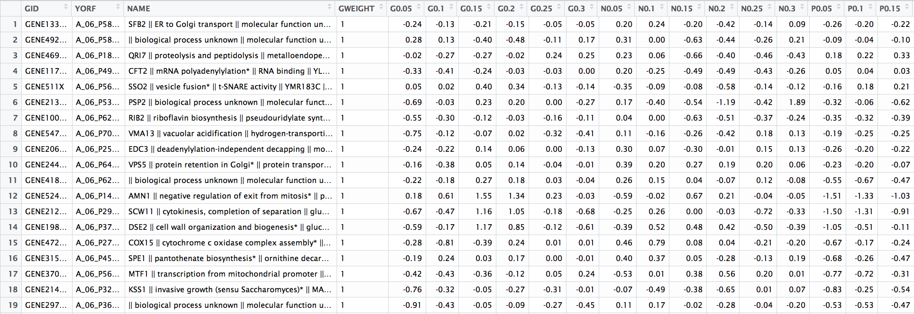

# Lab 2: The Shape of Data

You should clone this repository to get started with this lab.  The URL to clone is [https://github.com/lse-me314/assignment02](https://github.com/lse-me314/assignment02).  **You can find detailed instructions on how to do this [here](https://lse-me314.github.io/instructions).**

### Resources

* Examine the tutorial on [How to Reshape a Data.frame](how-to-manipulate-dataframe.ipynb).
* Use the other files in this repository for the exercise.  
* Don't omit reading the the great book _R for Data Science_.  [Chapter 12](http://r4ds.had.co.nz/tidy-data.html) is a fantastic resource for understanding data reshaping.  
* [Altaf's resource on **dplyr** and the "tidyverse"](https://altaf-ali.github.io/tidydata_tutorial)
* [Altaf's resource on **ggplot2**](https://altaf-ali.github.io/ggplot_tutorial)

### Assignment

1.  **Identifying the characteristics of "tidy" data.**

    a.  What makes the following example "non-tidy"?

    

    b.  Inspect the R object [`cmpdata.RData`] from the file of the same name.  (You can access this by opening the file from the Files pane of Rstudio.)  What makes this data non-tidy?

2.  **Reshaping in R.**

    Work with the file [me314-assignment2-LASTNAME-FIRSTNAME.Rmd](me314-assignment2-LASTNAME-FIRSTNAME.Rmd) (after renaming it!)
    

### Solutions

Solution to Assignment 2 as:
*  [html](solution/me314-assignment2-solution.html) 
*  [RMarkdown](solution/me314-assignment2-solution.Rmd)  
