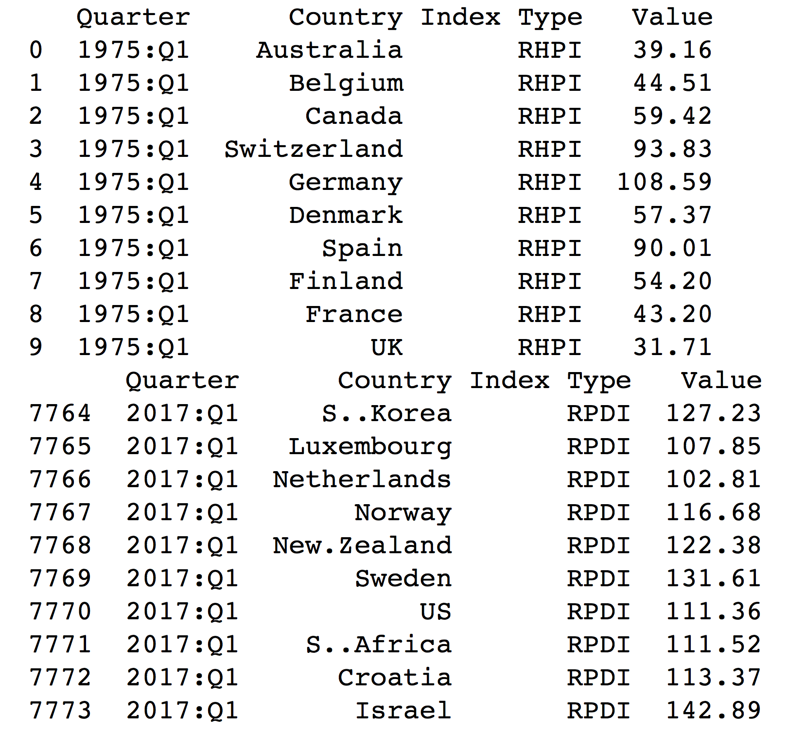

# Reshaping data in R

In this part of the assignment, we will again reshape [rhpi.csv](rhpi.csv) and [rpdi.csv](rpdi.csv), but this time we will use R to do it!

Take a look of the [assignment-2-complex-example-python.ipynb](assignment-2-complex-example-python.ipynb) and try to do the same using R. You only need to fill in the part 1-6 here. You do **not** need to do the pivot table.

You may find it useful to learn more how to use dataframe in R, read the [how-to-manipulate-dataframe.ipynb](how-to-manipulate-dataframe.ipynb).

If you get stuck somewhere, feel free to contact us! As this is a formative assignment, we are happy to give you a few lines of codes to help you to start.

## 1.  **Reshaping a simple example.**

a.  From the `cmpdata` object, replicate the reshaped object `cmpdataLong` from the lecture notes, using the **reshape2** package.  (Just use the same syntax as in the lecture notes.)

```{r}
library("reshape2")
load("cmpdata.Rdata")

cmpdataLong <- melt(cmpdata,
                    id.vars = c("countryname", "party", "date"),
                    measure.vars = names(cmpdata)[21:76],
                    variable.name = "category",
                    value.name = "catcount")
```

b.  Try using **tidyr** on `cmpdataLong` to `spread()` this back into the wide format.


```{r}
library("tidyr")

cmpdata <- spread(cmpdataLong, key = category, value = catcount)
head(cmpdata)
```


## 2. Load the HPI data

a. click into the [rhpi.csv](rhpi.csv) and have a look of the data. Does it have any header? How is each entry of the data separated? by space or comma?

b. take a look of the [`read.csv`](https://stat.ethz.ch/R-manual/R-devel/library/utils/html/read.table.html) function and read the csv data to R.

c. after the data is loaded into R, you can use [`head`](https://stat.ethz.ch/R-manual/R-devel/library/utils/html/head.html) function to take a look of the first few rows of data. Is it in long or wide format?

d. you may find out that the first column name is empty. You may update the first column name to "country" by using [`colnames`](https://stat.ethz.ch/R-manual/R-devel/library/base/html/colnames.html) function. And remember R starts counting from 1!

```{r}
rhpi_wide <- read.csv("rhpi.csv") #if this line does not work, check where you are by getwd()
head(rhpi_wide)
colnames(rhpi_wide)[1] <- "country"
head(rhpi_wide)
```

## 3. Convert the HPI data from wide to long

The original HPI data is in wide format. Each row represents a country and each column represents a quarter. This means that each row has the HPI values of **one** country and **different** quarters.

Here we would like to change it to long format so that each row has the a HPI value of **one** country and **one** quarter:

a. take a look of the [`melt()`](https://cran.r-project.org/web/packages/reshape2/reshape2.pdf) function and convert the the HPI data into long format. You may want to provide the following additional arguments (take a look of [http://seananderson.ca/2013/10/19/reshape.html] if you do not know how to set the arguments):
  * id
  * value.name
  * variable.name

b. use [`head()`](https://stat.ethz.ch/R-manual/R-devel/library/utils/html/head.html) to take a look of the data

c. you will notice that the quarter value somehow has the X at the beginning (e.g. X1970.Q3 instead of 1970.Q3). If you want to remove the X from the quarter value, take a look of the [`substring()`](https://stat.ethz.ch/R-manual/R-devel/library/base/html/substr.html) function.

```{r}
rhpi_long <- melt(rhpi_wide, id.vars = "country", variable.name = "quarter",
                  value.name = "hpi")

head(rhpi_long)

# Remove the X at the beginning of the variable label
rhpi_long$quarter <- substring(rhpi_long$quarter, first = 2)

head(rhpi_long)
```

You can optionally turn year and quarter into separate variables.

```{r}
rhpi_long_opt <- rhpi_long
rhpi_long_opt$year <- as.numeric(substring(rhpi_long_opt$quarter, first = 1, last = 4))
rhpi_long_opt$quarter <- as.numeric(substring(rhpi_long_opt$quarter, first = 7))
rhpi_long_opt <- data.frame(rhpi_long_opt$country, rhpi_long_opt$year,
                            rhpi_long_opt$quarter, rhpi_long_opt$hpi)
```

This last optional part is substantially simpler with the `dplyr` package.

```{r}
library("dplyr")
rhpi_long_alt <- mutate(
   .data = rhpi_long,
   year = as.numeric(substring(quarter, first = 1, last = 4)),
   quarter = as.numeric(substring(quarter, first = 7))
)
rhpi_long_alt <- select(rhpi_long_alt, country, year, quarter, hpi)
```

## 4. Load the PDI data and convert the PDI data from wide to long

```{r}
# This code is the same as above for 3c with changed file and object name
rpdi_wide <- read.csv("rpdi.csv")
colnames(rpdi_wide)[1] <- "country"
rpdi_long <- melt(rpdi_wide, id.vars = "country", variable.name = "quarter",
                  value.name = "pdi")
rpdi_long$quarter <- substring(rpdi_long$quarter, first = 2)
head(rpdi_long)
```

## 5. Merge the long format HPI and PDI data

a. take a look of the [`merge())`](https://stat.ethz.ch/R-manual/R-devel/library/base/html/merge.html) function and merge the two dataframes together. You should provide the "```by```" argument. What should be the unique identifier? Country? Quarter? Or both?

b. take a look of the merged data using [`head())`](https://stat.ethz.ch/R-manual/R-devel/library/utils/html/head.html) to make sure the data are merged properly.

```{r}
merged <- merge(rhpi_long, rpdi_long, by = c("country", "quarter"))

head(merged)
```

## 6. Filter the data

a. take a look of the [`which()`](https://stat.ethz.ch/R-manual/R-devel/library/base/html/which.html) function. This function will return you the indices that a given condition is fulfilled.

b. filter the data so that only Australia data is shown.

c. use [`head())`](https://stat.ethz.ch/R-manual/R-devel/library/utils/html/head.html) and [`tail()`](https://stat.ethz.ch/R-manual/R-devel/library/utils/html/head.html) functions to take a look of the data to make sure you filtered the data correctly.

```{r}
# It is much easier to use the subset() function instead of which() here
merged_aus <- subset(merged, country == "Australia")
head(merged_aus)
```

## 7. Melt the data

Try to use the `melt()` function again to produce a dataframe that is similar to this object:



```{r}
merged_long <- melt(merged, id.vars = c("country", "quarter"), variable.name = "type")

head(merged_long)
tail(merged_long)
```
